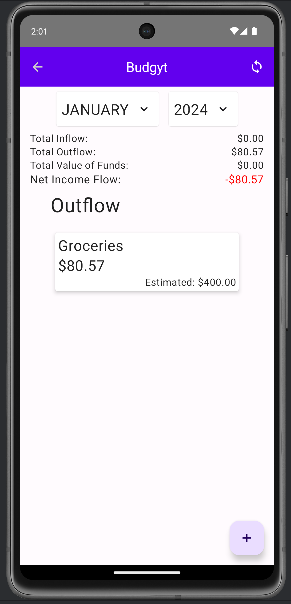
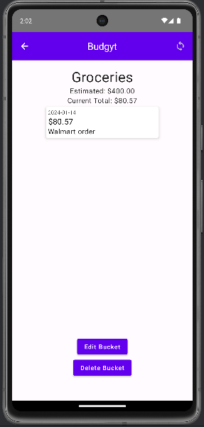
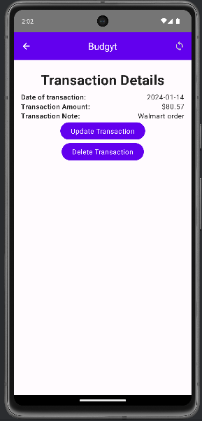
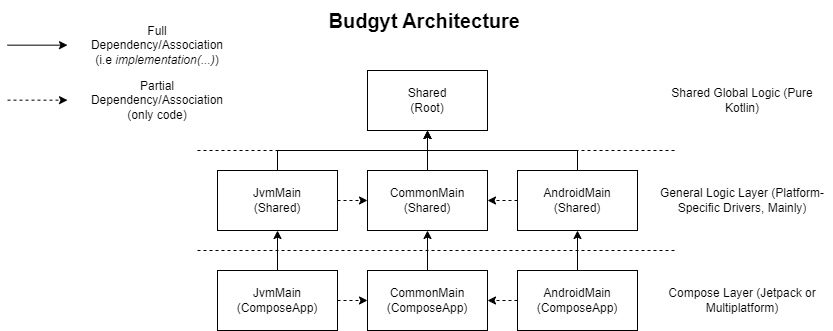
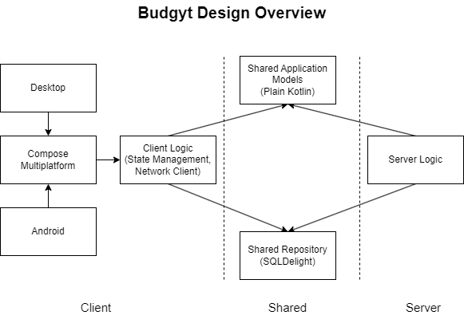

# Budgyt
A simple but sophisticated budgeting app, built for the Kotlin Multiplatform Contest 2024.

## Overview/Problem Statement

Budgeting is a core part of good personal finance habits. I had been using a spreadsheet for about a year, tracking income, expenses, and money goals. As much as it was functional, it wasn't very ergonomic to open Google Sheets, open the spreadsheet, scroll to the cell, and add the value. I needed a better solution with the following criteria:

1. **Better UI/UX**. Limit the time spent clicking around in menus or scrolling through spreadsheets.
2. **Multiplatform**. I want to be able to input a transaction into my budgeting spreadsheet whether I'm at my desk or on the go.
3. **Local-first**. Although it's nice to have everything sync, I don't want to *have* to rely on a server in order to keep track of things. Input it now, sync it up later.

It turns out, Kotlin Multiplatform solved most of these problems.

This is a Kotlin Multiplatform project targeting Android, Desktop, Server.

## Demonstration

### Screenshots

## High Level Overview
The project is a Kotlin Multiplatform application with a Compose Multiplatform (Desktop/Android) front-end, as well as a Kotlin-based backend.

| Functionality | Libraries and Process Used |
| -|-|
| Core Functions | Kotlin Multiplatform |
| Frontend Framework | [Compose Multiplatform](https://www.jetbrains.com/lp/compose-multiplatform/) with Material3
| Asynchrononous Operations | Kotlin Coroutines
| State Management | [Decompose](https://github.com/arkivanov/Decompose), MVVM-like pattern |
| Data Persistence | [SQLDelight](https://github.com/cashapp/sqldelight) with SQLite (Android) and in-memory (Desktop, Server) drivers |
| Client-Server Communication | [Ktor](https://ktor.io/) |

### Architecture

Attached is a high-level architecture view of Budgyt. On the **ComposeApp** side of the project, both `AndroidMain` and `JvmMain` borrow heavily from the shared `CommonMain` project, which contains all of the Compose logic. Each component is also dependent (linked in most cases) to their counterparts in the `Shared` module, which contains both platform-specific implementations using `expect/actual` as well as common code, which is primarily plain Kotlin with very little additional dependencies.

### What is Shared?
- **All** of the Compose code is shared between Android and Desktop.
- **All** of the data persistence interaction code (communication betwen logic and DB layer) is shared - across ALL platforms (Android, Desktop, AND Backend)
- **All** of the state management (Decompose) and networking (Ktor client) code is shared between Android and Desktop
- The only platform-specific code between Android and Desktop are:
  - Initialization code - Activities for Android and Window (Compose Multiplatform Desktop) for Desktop.
  - Data persistence driver code - SQLite for Android and an in-memory store (for now) for Desktop
  > Note: There is also a unique remote host string for both platforms. This is because Android's emulator uses a different IP for linking back to the local machine.

The client and server run off of the same schema on both an application and database level. This allowed me to do a "write-once, deploy everywhere" approach where I essentially didn't need to do anything to allow me to have both a local database as well as synchronizing with the remote repository.

This would additional make it easier in the future to make updates to the model, as we could propogate those changes across the entire stack.

## Cloning and Running
> Note: The installation and run steps assume that you have a relatively-recent version of JDK (I am using JDK17) as well as Android Studio (I am still on version Giraffe but the steps should not differ much).
1. Clone the repository into your directory of choice.
2. Allow Gradle to do its work to pull dependencies and index the project.

### Android
1. The Android project should show up as a Gradle runnable at the top of Android Studio automatically.

> Note: The default remote endpoint is set to `http://10.0.2.2` and remote sync will not work properly on a physical device unless that is changed under `shared/src/androidMain/kotlin/RemoteHost.android.kt`.

### Desktop
To run the desktop client, run the following command on your terminal:
`./gradlew :composeApp:run`

This should build the project and start the desktop client.

### Server
There are multiple ways to run the server:
- Assuming that `ApplicationKt` shows up as a valid run configuration, clicking "Run" should build the project and run the sever.
- Alternatively, navigating to `/server/src/main/kotlin/com/technology626/budgyt/Application.kt` and manually running `main()` should also start the server.

## What's Next?
There are a lot of things that I didn't quite get to in the timeframe of the hackathon one way or another. These include...
- Adding proper dependency injection, likely using Koin. I've used Koin in the past, and as the scope of the project continues to grow, I believe it would make sense to have a library manage dependencies for me.
- Additional UI/UX improvements. I am by no means a designer, I imagine that there is a lot of work that can be done to further improve the look and feel of Budgyt
- More features! There are some things from my spreadsheet that have yet to be migrated, namely net worth calculations. I would love to see integration with Plaid possible one day.
- Graphs! I was excited to see [Kandy for Kotlin](https://github.com/Kotlin/kandy) announced through a blog, but unfortunately it seems that Compose Multiplatform support [is yet to arrive](https://github.com/Kotlin/kandy/issues/270). I'm sure there are other frameworks out there too that are pursuing this space. 